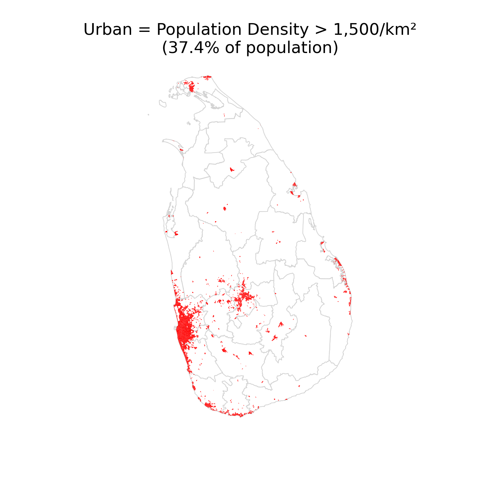
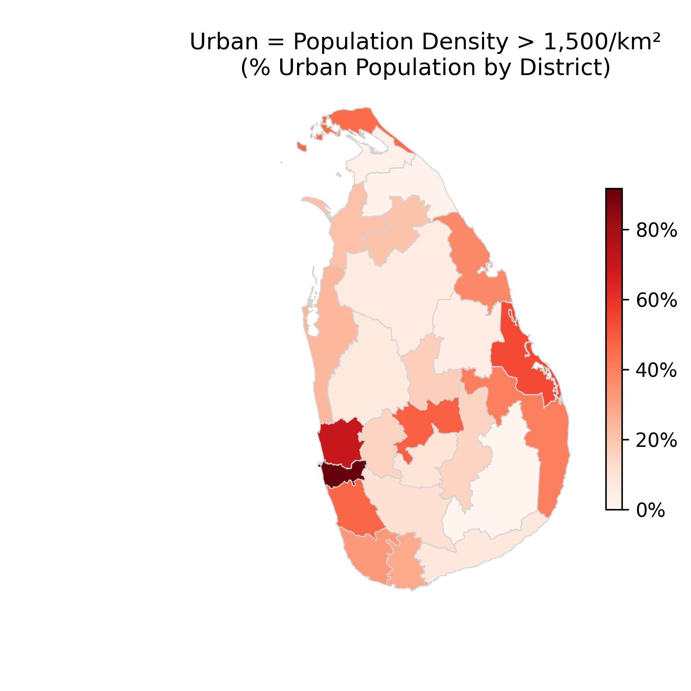
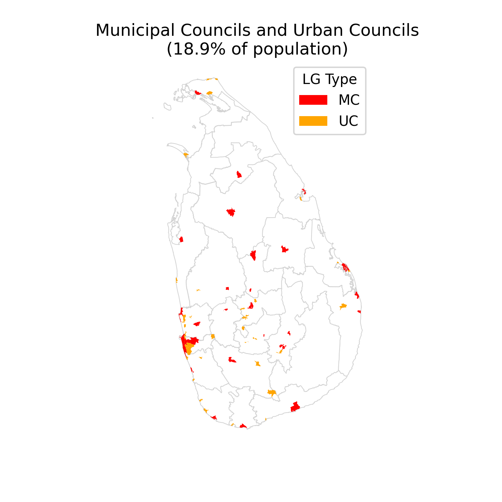
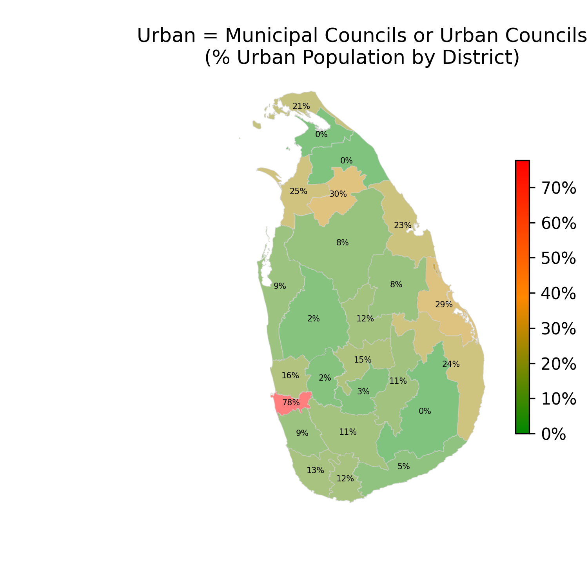

# How Urban is Sri Lanka?

## What Does "Urban" Mean?

Urbanisation is one of the most consequential transformations of the modern world; yet surprisingly, no two countries agree on what "urban" actually means. The United Nations notes that national definitions vary so widely that international comparisons of urbanisation rates are often misleading [1].

Some countries define a settlement as urban if it exceeds 200 people (Norway); others set thresholds at 2,000 (France), 5,000 (India), or even 50,000 (Japan) [2]. Some definitions are purely administrative: a place is urban if the government has classified it as such. Others are functional, focusing on population density, economic activity, or the proportion of non-agricultural employment [3].

The reason for this diversity is that "urban" is not a natural category. It is a policy construct. Governments define it to serve specific purposes: allocating infrastructure budgets, planning public services, measuring development progress. A sparsely populated market town might be "urban" in one country's census and "rural" in another's.

For Sri Lanka, this ambiguity is particularly interesting. The country has a long history of dense rural settlement, with rice-farming villages clustered around ancient irrigation tanks. A substantial proportion of its population lives in areas that feel urban but are not officially classified as such [4]. The Western Province, especially the Colombo metropolitan region, hosts a continuous sprawl that defies simple rural/urban binaries [5].

This analysis explores two very different proxies for urbanness in Sri Lanka, examines the maps they produce, and reflects on what each approach reveals and conceals.

## Two Approaches to Measuring Urbanness

Neither of the two approaches below is an official government definition. They are our own analytical classifications; proxies that we believe capture meaningfully different dimensions of what it means to be "urban" in Sri Lanka.

### 1. Population Density

Our first approach uses population density as a proxy for urbanness. We classify a Grama Niladhari Division (GND), Sri Lanka's smallest administrative unit, as **urban if its population density exceeds 1,500 people per km²**.

We chose this threshold because it sits comfortably within the range used in comparative urbanisation studies [3], and because it captures the core intuition that density is the essence of urban life: proximity to other people, access to shared infrastructure, and economic agglomeration. The choice is deliberate but not definitive; a different threshold would shift the numbers, though the broad spatial patterns would remain.

#### Pros

- Objective and consistently measurable across time
- Independent of administrative boundaries, which may lag behind ground realities
- Comparable with international datasets and research [3]
- Captures peri-urban sprawl that official classifications miss

#### Cons

- The threshold is arbitrary: why 1,500 and not 1,000 or 2,000?
- Density alone ignores the character of a place; a dense refugee camp is not the same as a dense city centre
- GND boundaries vary enormously in area, introducing geometric artefacts
- Does not reflect access to services, economic function, or infrastructure

#### The Density Map

The density map reveals a striking picture. Urban Sri Lanka, by the density criterion, is highly concentrated in the Western Province; it forms a near-continuous band of high-density settlement stretching from Colombo south to Kalutara and north to Negombo, and inland toward Kotte and Kaduwela. Secondary concentrations appear around Kandy in the Central Province, Galle and Matara on the southern coast, and Jaffna in the Northern Province.

A notable outlier is the Eastern Province, where Batticaloa town and its surrounding GNDs register as urban despite the district's otherwise rural character. Batticaloa's coastal urban core, historically a commercial and administrative centre, stands out as a pocket of high density in an otherwise sparsely settled region, a pattern also visible to a lesser extent in Trincomalee.

The map also exposes how thinly settled most of the island's interior and north-central regions are. The vast dry-zone districts of Anuradhapura, Polonnaruwa, and Monaragala, collectively covering over a third of the island's land area, contribute almost nothing to urban population by this measure. Most strikingly, the war-affected districts of Kilinochchi and Mullaitivu in the Northern Province register virtually no urban GNDs at all under this definition, a legacy of displacement and underdevelopment that persisted well beyond the end of the civil conflict.

#### Urban Population by District (Density Method)

The district-level choropleth shows just how unequal the distribution is. Colombo District stands alone at the most urban end of the spectrum, with a large majority of its population living in high-density GNDs. Gampaha and Kalutara follow, reflecting the Western Province's extended metropolitan character [4]. At the other end, the predominantly rural districts of the north-central and eastern zones show very low urban shares under this definition.

### 2. Local Authority Classification

Our second approach draws on Sri Lanka's local government structure as an administrative proxy for urbanness. The country's Local Government institutions are classified into three tiers under the Local Authorities Elections Ordinance [6]:

- **Municipal Councils (MC)**: the largest and most urban, covering major cities
- **Urban Councils (UC)**: mid-tier urban authorities
- **Pradeshiya Sabhas (PS)**: rural local government bodies

We classify an area as **urban if it falls within a Municipal Council or Urban Council jurisdiction**, and rural if it is governed by a Pradeshiya Sabha. This mirrors the administrative definitions used in many South and Southeast Asian countries [2], and has the advantage of being grounded in the state's own institutional categorisation.

#### Pros

- Officially recognised; reflects the state's own classification of urban areas
- Correlated with actual service provision: MCs and UCs typically have better roads, water supply, waste collection [6]
- Stable and well-documented across census years [4]

#### Cons

- Administrative boundaries change very slowly; many areas have urbanised without reclassification [5]
- The system was largely inherited from the colonial period and may not reflect contemporary realities
- A Pradeshiya Sabha area immediately adjacent to a Municipal Council may be functionally identical to it
- Urban Council status in some small towns may overstate their urban character relative to larger PS areas

#### The Local Authority Map

The local authority map tells a broadly similar story to the density map, but with important differences. Red areas (Municipal Councils) are concentrated in the major cities: Colombo, Kandy, Galle, Jaffna, Trincomalee, Batticaloa, and a handful of others. Orange areas (Urban Councils) form a wider ring around these cores and pepper secondary towns across the island.

Compared to the density map, the local authority map is coarser; it classifies entire administrative areas uniformly rather than mapping the fine-grained texture of settlement. Several dense GNDs that appeared urban in the density map fall within Pradeshiya Sabha areas and are classified as rural here.

#### Urban Population by District (Local Authority Method)

The district choropleth for the local authority method shows a more dispersed pattern than the density equivalent. Because Urban Councils exist in small towns throughout the island, not just in the Western Province, districts like Kurunegala, Ratnapura, and Badulla register higher urban shares than the density map would suggest. Conversely, some large Pradeshiya Sabha areas adjacent to Colombo register as rural despite their evident density [5].

The most striking feature of this map is at the bottom of the scale. Three districts, **Kilinochchi**, **Mullaitivu**, and **Monaragala**, have no Municipal Councils and no Urban Councils whatsoever. Every local authority in these districts is a Pradeshiya Sabha, meaning that under this definition their urban population is precisely zero. For Kilinochchi and Mullaitivu, this reflects the severe destruction of institutional infrastructure during the civil war and the slow pace of post-war administrative reconstruction. For Monaragala, it reflects the district's persistently agricultural and sparsely settled character. All three are a reminder that the local authority classification is as much a product of political history as of actual settlement patterns.

## Comparing the Two Approaches

| | Density (>1,500/km²) | Local Authority (MC/UC) |
|---|---|---|
| **Definition type** | Functional / morphological | Administrative |
| **Urban share of population** | Moderate | Moderate–high |
| **Geographic concentration** | High (Western Province dominant) | More dispersed |
| **Sensitivity to sprawl** | High | Low |
| **Sensitivity to small towns** | Low | High |
| **International comparability** | High [3] | Low [1] |

The two methods agree on the broadest strokes: the Western Province is the most urban part of Sri Lanka, and the dry-zone interior is the least. But they diverge substantially in the details. The density method is more sensitive to metropolitan sprawl; the local authority method gives more weight to the island's network of small provincial towns.

Neither method is "correct." Together, they bracket the true extent of urbanisation: the density method is likely a lower bound for the Western Province and the local authority method a useful complement for the rest of the island.

## Conclusion

Sri Lanka's urbanisation story is more complex than any single number can capture. By population density, the country appears to have a highly concentrated urban core centred on Colombo. By administrative classification, urban settlement is more evenly distributed across the island's towns and secondary cities.

What both approaches agree on is the dominant role of the Western Province, the secondary importance of Kandy as a central highland hub, and the relative rurality of the north-central and eastern regions. As Sri Lanka continues to urbanise, a process that slowed but did not reverse during the recent economic crisis [7], revisiting and refining these definitions will matter more, not less, for infrastructure planning, climate adaptation, and equitable development.

## Appendix: References

[1] United Nations Department of Economic and Social Affairs (UN DESA). *Principles and Recommendations for Population and Housing Censuses, Revision 3*. United Nations, New York, 2017. <https://unstats.un.org/unsd/demographic-social/Standards-and-Methods/files/Principles_and_Recommendations/Population-and-Housing-Censuses/Series_M67rev3-E.pdf>

[2] UN DESA Population Division. *World Urbanization Prospects: The 2018 Revision*. United Nations, New York, 2019. <https://population.un.org/wup/>

[3] Dijkstra, L., Poelman, H., & Veneri, P. *The EU-OECD Definition of a Functional Urban Area*. OECD Regional Development Working Papers 2019/11, OECD Publishing, Paris, 2019. <https://doi.org/10.1787/d58cb34d-en>

[4] Department of Census and Statistics, Sri Lanka. *Census of Population and Housing 2012: Population Atlas of Sri Lanka*. Ministry of Finance and Planning, Colombo, 2012. <http://www.statistics.gov.lk/PopHouSat/CPH2012Visualization/>

[5] Asian Development Bank. *Sri Lanka: Improving the Urban–Rural Interface — Urbanization Patterns and Policies*. ADB, Manila, 2014. <https://www.adb.org/publications/sri-lanka-urbanization>

[6] Ministry of Provincial Councils and Local Government, Sri Lanka. *Local Authorities Elections Ordinance (Chapter 262) and Municipal Councils Ordinance (Chapter 252)*. Government of Sri Lanka. <https://www.localgovernment.gov.lk/>

[7] World Bank. *Sri Lanka Development Update 2023: Aiming for the Sky*. World Bank Group, Washington D.C., 2023. <https://www.worldbank.org/en/country/srilanka/publication/sri-lanka-development-update>

## Appendix: Code and Data

Analysis and maps by [nuuuwan](https://github.com/nuuuwan/lk_urban). Population data from the 2012 Census of Population and Housing, Sri Lanka.
